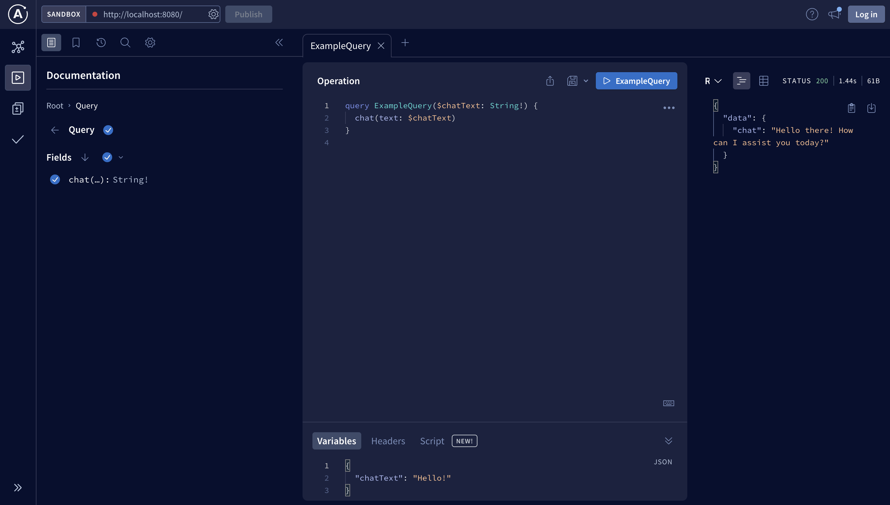

# OpenAI Graph (Hackdays Q1 2023)
This is a simple [Apollo Server](https://www.apollographql.com/docs/apollo-server/)
wrapped around [OpenAI APIs](https://openai.com/blog/openai-api).

### Goals
The goal of this project is to provide a way to leverage the 
OpenAI APIs for the purpose of creating an interactive chat bot
related to Optimizely's products and offerings.

### Local Development
Make a .env file from .env.example and add OpenAI API key
```bash
cp .env.example .env
```
Setting up the project and running it is as simple as installing
the dependencies and running the application:
```bash
npm ci && npm start
```

There are a couple of helper scripts that get called with `npm start`:
```bash
npm lint; // lints typescript files
npm tsc; // compiles typescript
```

**CAVEATS**  
Because we're leveraging typescript, it is important to always include the
import file extensions as `.js` since that is what they get compiled to! If you
don't do this the compiled application will complain about being unable to find the
imports.

### Queries

#### Chat
ChatGPT query message:
```text
query chat {
   chat(text: "Hello!")
}
```


